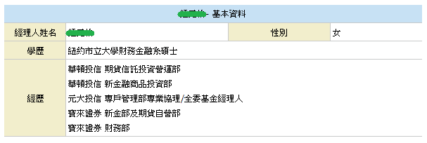

# [Project 1 - Web scraping (crawling the MoneyDJ website's fund and fund manager data)](https://github.com/ThomasTsao47/DataAnalysis_Projects/blob/main/Project%201%20-%20Web%20scraping.py)
- 專案動機: 碩士論文所需的部分基金及基金經理人的特徵資料無法從現有財金資料庫取得，故善用網路爬蟲套件收集 MoneyDJ 網站的數據來達成此需求
- 數據來源: [MoneyDJ理財網](https://www.moneydj.com/funddj/yb/YP301000.djhtm)
- 使用工具: Python (beautifulsoup, requests, re, pandas, time, random)
- 爬取欄位資料: [經理人姓名, 性別, 學歷]，[經理人, 時間, 期間(月), 操作績效(%), 台股績效(%)]，[基金類型, 基金名稱, 基金統編, 手續費, 保管費]

# Project 2 - Sales analysis
- 待增加
   
