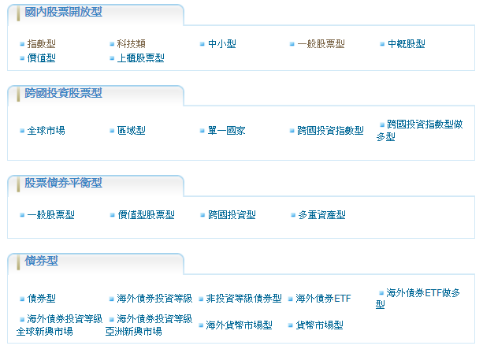
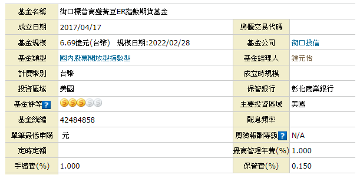
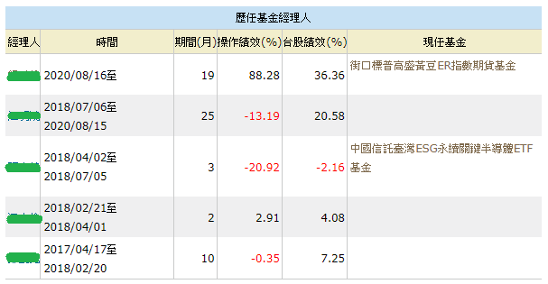
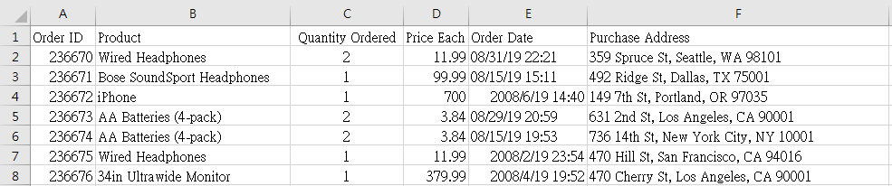
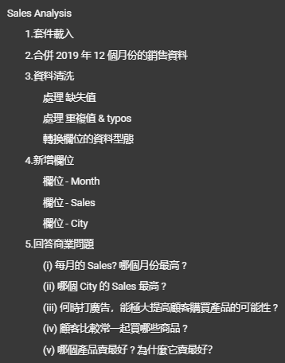
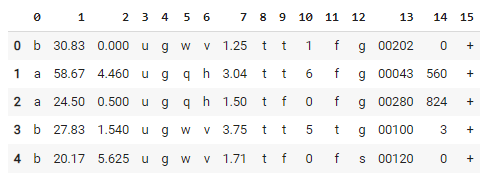

# [Project 1 - Web scraping (crawling the MoneyDJ website's fund and fund manager data)](https://github.com/ThomasTsao47/DataAnalysis_Projects/blob/main/Project%201%20-%20Web%20scraping.py)
- 專案動機: 碩士論文所需的部分基金及基金經理人的特徵資料無法從現有財金資料庫取得，故善用網路爬蟲套件收集 MoneyDJ 網站所有國內基金數據來達成此需求
- 使用工具: Python (beautifulsoup, requests, re, pandas, time, random)
- 參考文件: [Beautiful Soup Documentation](https://www.crummy.com/software/BeautifulSoup/bs4/doc/)
- 爬取數據來源: [MoneyDJ理財網](https://www.moneydj.com/funddj/yb/YP301000.djhtm)
- 爬取資料: [經理人姓名, 性別, 學歷]，[經理人, 時間, 期間(月), 操作績效(%), 台股績效(%)]，[基金類型, 基金名稱, 基金統編, 手續費, 保管費]
- 簡述統計: 資料筆數(9455)，基金檔數(3101)，經理人個數(1490) 

# [Project 2 - Sales analysis](https://github.com/ThomasTsao47/Portfolio/blob/main/Project%202%20-%20Sales%20analysis.ipynb)
- 專案介紹: 探索一份2019年在美國的3C產品銷售狀況的資料集，並從中回答商業問題  
- 使用工具: Python (pandas, matplotlib, glob, combinations, Counter)
- 數據取得: [Sales Data](https://github.com/ThomasTsao47/Portfolio/tree/main/data/Sales_data)
- 資料欄位: Order ID, Product, Quantity Ordered, Price Each, Order Date, Purchase Address

# [Project 3 - Predicting Credit Card Approvals](https://github.com/ThomasTsao47/Portfolio/blob/main/Project%203%20-%20Predicting%20Credit%20Card%20Approvals.ipynb)
- 專案介紹: 現代人向商業銀行申請信用卡似乎已成常態。然而，申請人可能因某些原因而被拒絕，例如不良貸款紀錄、低收入水平、有其他負債等。傳統利用人工查核的方式不僅容易出錯且耗時，還產生高額人力成本。如今，因科技的進步，使得很多商業銀行想要採用 AI 來實現信用卡審核自動化。因此，本專案將採用 機器學習 構建一個信用卡審核預測器，以滿足銀行需求。
- 使用工具: Python (numpy, pandas, sklearn)
- 數據取得: [UCI ML Repository - Credit Approval Data Set](http://archive.ics.uci.edu/ml/datasets/credit+approval)
- 資料欄位說明: 由於信用卡申請的相關數據牽涉個資問題，所以數據集的貢獻者匿名了特徵名稱。

